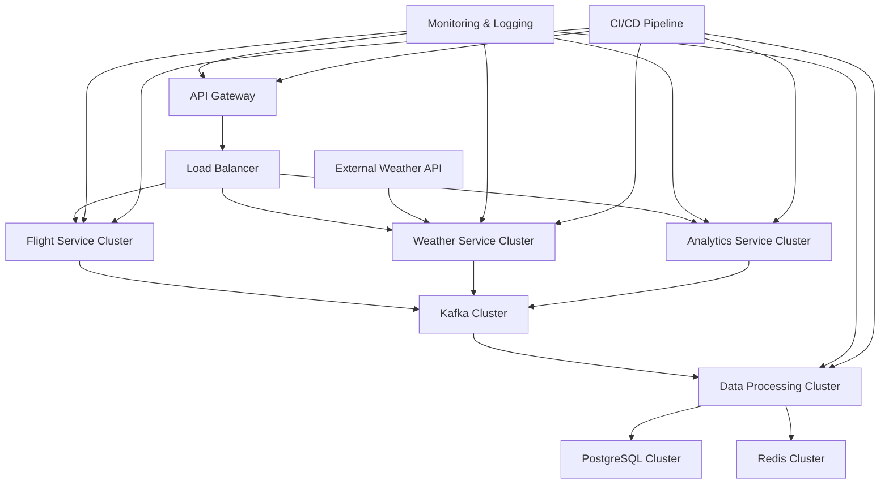

# Aether: Flight Weather Information System

<div align="center">


[](https://github.com/aether/backend/actions)
[](https://coveralls.io/github/aether/backend?branch=main)
[](https://opensource.org/licenses/Apache-2.0)
[](https://github.com/prettier/prettier)
[](CODE_OF_CONDUCT.md)
[](https://hub.docker.com/r/aether/backend)
[](https://badge.fury.io/js/aether-backend)

*Empowering the aviation industry with real-time, high-precision weather intelligence.*

[Features](#features) • [Quick Start](#quick-start) • [Documentation](#documentation) • [Contributing](#contributing) • [Support](#support)

</div>

## Table of Contents

1. [Introduction](#introduction)
2. [Key Features](#key-features)
3. [System Architecture](#system-architecture)
4. [Technology Stack](#technology-stack)
5. [Quick Start](#quick-start)
6. [Installation](#installation)
7. [Configuration](#configuration)
8. [Usage](#usage)
9. [API Reference](#api-reference)
10. [Data Model](#data-model)
11. [Core Functionalities](#core-functionalities)
12. [Database Schema](#database-schema)
13. [Kafka Integration](#kafka-integration)
14. [Redis Caching Strategy](#redis-caching-strategy)
15. [Security Measures](#security-measures)
16. [Scalability and Performance](#scalability-and-performance)
17. [Monitoring and Observability](#monitoring-and-observability)
18. [Disaster Recovery and High Availability](#disaster-recovery-and-high-availability)
19. [Development Workflow](#development-workflow)
20. [Testing Strategy](#testing-strategy)
21. [Deployment Guide](#deployment-guide)
22. [Troubleshooting](#troubleshooting)
23. [Research and Innovation](#research-and-innovation)
24. [Compliance and Standards](#compliance-and-standards)
25. [Contributing](#contributing)
26. [Code of Conduct](#code-of-conduct)
27. [License](#license)
28. [Acknowledgments](#acknowledgments)
29. [Support and Contact](#support-and-contact)
30. [Changelog](#changelog)

## Introduction

Aether is a state-of-the-art, high-performance backend system engineered to deliver real-time weather intelligence for the aviation industry. Designed to process over 3,000 daily flight tickets, Aether provides precise, up-to-the-minute weather conditions for both origin and destination airports, empowering airlines and travelers with critical meteorological insights.

### Vision

To revolutionize aviation safety and efficiency by providing the most accurate, timely, and actionable weather intelligence globally.

### Mission

Deliver a robust, scalable, and reliable platform that processes vast amounts of flight and weather data, offering unparalleled insights to our aviation partners.

## Key Features

- **High-Volume Processing**: Efficiently handles 3,000+ daily flight tickets with room for exponential growth.
- **Real-time Weather Intelligence**: Utilizes advanced APIs and predictive models for accurate weather forecasting.
- **Intelligent Caching**: Implements a sophisticated Redis-based caching strategy to optimize performance and reduce API calls.
- **Scalable Architecture**: Leverages Kafka for reliable, high-throughput message processing.
- **Comprehensive API**: RESTful and GraphQL APIs for flexible data access and integration.
- **Advanced Analytics**: Machine learning models for pattern recognition and predictive insights.
- **Multi-region Support**: Designed for global deployment with region-specific optimizations.
- **Regulatory Compliance**: Adheres to aviation industry standards and data protection regulations.
- **Robust Security**: Implements industry-leading security practices to protect sensitive data.
- **Extensible Platform**: Modular design allows for easy integration of new data sources and features.

## System Architecture

Our architecture is designed for high availability, fault tolerance, and horizontal scalability:



## Technology Stack

- **Backend Framework**: NestJS 10.x (Node.js)
- **Language**: TypeScript 5.x
- **Database**: PostgreSQL 15.x with TimescaleDB extension
- **Message Broker**: Apache Kafka 3.5.x
- **Caching**: Redis 7.x
- **API Protocols**: REST, GraphQL (Apollo Server)
- **Container Orchestration**: Kubernetes 1.27.x
- **CI/CD**: GitHub Actions, ArgoCD
- **Monitoring**: Prometheus, Grafana, ELK Stack
- **Testing**: Jest, Supertest, k6
- **Documentation**: Swagger/OpenAPI 3.0, Docusaurus

## Quick Start

Get Aether up and running in your local environment:

```bash
# Clone the repository
git clone https://github.com/aether/backend.git
cd aether-backend

# Install dependencies
npm install

# Set up environment variables
cp .env.example .env
# Edit .env with your configurations

# Start the development environment
docker-compose up -d

# Run database migrations
npm run migration:run

# Start the application
npm run start:dev
```

Visit `http://localhost:3000/api-docs` for API documentation.

## Installation

For a comprehensive installation guide, including setting up development, staging, and production environments, please refer to our [Installation Guide](docs/installation.md).

## Configuration

Aether uses a combination of environment variables and configuration files to manage different environments and deployments.

Key configuration files:
- `.env`: Environment-specific variables
- `config/default.js`: Default configuration
- `config/production.js`: Production overrides

For a complete list of configuration options and best practices, see our [Configuration Guide](docs/configuration.md).

## Usage

### Starting the Server

```bash
# Development mode
npm run start:dev

# Production mode
npm run build
npm run start:prod
```

### Processing Flight Data

1. Ensure your flight data adheres to our [Data Format Specification](docs/data-format-spec.md).
2. Use the data ingestion API to upload flight data:

```bash
curl -X POST -H "Content-Type: application/json" \
     -H "Authorization: Bearer YOUR_API_KEY" \
     -d @flight-data.json \
     https://api.aether.com/v1/flights/ingest
```

3. Monitor the processing status through the `/v1/status` endpoint.
4. Retrieve weather reports using the `/v1/reports` endpoint.

For detailed API usage examples, refer to our [API Guide](docs/api-guide.md).

## API Reference

Our API is documented using OpenAPI 3.0 specifications. When the server is running, you can access the interactive API documentation at `http://localhost:3000/api-docs`.

For a comprehensive API reference, including request/response examples and authentication details, see our [API Reference Documentation](https://developer.aether.com/api).

## Data Model

### Core Entities

```typescript
interface FlightTicket {
  id: string;
  origin: string;
  destination: string;
  airline: string;
  flightNumber: string;
  departureTime: Date;
  arrivalTime: Date;
  status: FlightStatus;
}

interface Airport {
  iataCode: string;
  name: string;
  city: string;
  country: string;
  latitude: number;
  longitude: number;
  elevation: number;
  timezone: string;
}

interface WeatherData {
  airportCode: string;
  timestamp: Date;
  temperature: number;
  feelsLike: number;
  humidity: number;
  windSpeed: number;
  windDirection: string;
  precipitation: number;
  pressure: number;
  visibility: number;
  cloudCover: number;
  condition: WeatherCondition;
}

interface FlightWeatherReport {
  id: string;
  flightTicketId: string;
  createdAt: Date;
  originWeather: WeatherData;
  destinationWeather: WeatherData;
  enRouteWeather: WeatherData[];
}
```

For a complete data model specification, including enums and relationships, see our [Data Model Documentation](docs/data-model.md).

## Core Functionalities

### Flight Data Ingestion

```typescript
async function ingestFlightData(data: CreateFlightTicketDto[]): Promise<IngestResult> {
  const validationResult = await validateFlightData(data);
  if (!validationResult.isValid) {
    throw new ValidationError(validationResult.errors);
  }

  const flightTickets = mapToFlightTickets(data);
  
  await this.flightRepository.saveMany(flightTickets);

  await this.kafkaProducer.send({
    topic: 'flight-data-ingested',
    messages: flightTickets.map(ticket => ({
      key: ticket.id,
      value: JSON.stringify(ticket),
    })),
  });

  return {
    processedCount: flightTickets.length,
    status: 'success',
  };
}
```

### Weather Data Retrieval with Caching

```typescript
async function getWeatherForAirport(iataCode: string): Promise<WeatherData> {
  const cacheKey = `weather:${iataCode}`;
  
  try {
    const cachedData = await this.redisClient.get(cacheKey);
    if (cachedData) {
      this.metricsService.incrementCacheHit('weather');
      return JSON.parse(cachedData) as WeatherData;
    }

    const weatherData = await this.weatherApiClient.getWeather(iataCode);
    
    await this.redisClient.setex(cacheKey, this.config.weatherCacheTTL, JSON.stringify(weatherData));
    
    this.metricsService.incrementCacheMiss('weather');
    return weatherData;
  } catch (error) {
    this.logger.error(`Failed to retrieve weather data for ${iataCode}`, error);
    throw new WeatherDataRetrievalError(iataCode);
  }
}
```

### Report Generation

```typescript
async function generateWeatherReport(flightId: string): Promise<FlightWeatherReport> {
  const flight = await this.flightRepository.findById(flightId);
  if (!flight) {
    throw new FlightNotFoundError(flightId);
  }

  const [originWeather, destinationWeather] = await Promise.all([
    this.getWeatherForAirport(flight.origin),
    this.getWeatherForAirport(flight.destination),
  ]);

  const enRouteWeather = await this.calculateEnRouteWeather(flight);

  const report: FlightWeatherReport = {
    id: generateUUID(),
    flightTicketId: flight.id,
    createdAt: new Date(),
    originWeather,
    destinationWeather,
    enRouteWeather,
  };

  await this.reportRepository.save(report);
  await this.notificationService.notifyReportGeneration(report);

  return report;
}
```

For more detailed documentation on core functionalities, including error handling and performance optimizations, see our [Core Functionalities Guide](docs/core-functionalities.md).

## Database Schema

Our PostgreSQL schema is designed for performance and scalability, utilizing TimescaleDB for efficient time-series data management:

```sql
CREATE TABLE flight_tickets (
    id UUID PRIMARY KEY,
    origin CHAR(3) NOT NULL,
    destination CHAR(3) NOT NULL,
    airline CHAR(3) NOT NULL,
    flight_number VARCHAR(10) NOT NULL,
    departure_time TIMESTAMPTZ NOT NULL,
    arrival_time TIMESTAMPTZ NOT NULL,
    status flight_status NOT NULL,
    created_at TIMESTAMPTZ DEFAULT CURRENT_TIMESTAMP,
    updated_at TIMESTAMPTZ DEFAULT CURRENT_TIMESTAMP
);

CREATE TABLE airports (
    iata_code CHAR(3) PRIMARY KEY,
    name VARCHAR(100) NOT NULL,
    city VARCHAR(50) NOT NULL,
    country VARCHAR(50) NOT NULL,
    latitude DECIMAL(10, 8) NOT NULL,
    longitude DECIMAL(11, 8) NOT NULL,
    elevation INTEGER NOT NULL,
    timezone VARCHAR(50) NOT NULL
);

CREATE TABLE weather_data (
    id UUID PRIMARY KEY,
    airport_code CHAR(3) NOT NULL REFERENCES airports(iata_code),
    timestamp TIMESTAMPTZ NOT NULL,
    temperature DECIMAL(5, 2) NOT NULL,
    feels_like DECIMAL(5, 2) NOT NULL,
    humidity INTEGER NOT NULL,
    wind_speed DECIMAL(5, 2) NOT NULL,
    wind_direction VARCHAR(3) NOT NULL,
    precipitation DECIMAL(5, 2) NOT NULL,
    pressure INTEGER NOT NULL,
    visibility DECIMAL(6, 2) NOT NULL,
    cloud_cover INTEGER NOT NULL,
    condition weather_condition NOT NULL
);

SELECT create_hypertable('weather_data', 'timestamp');

CREATE TABLE flight_weather_reports (
    id UUID PRIMARY KEY,
    flight_ticket_id UUID NOT NULL REFERENCES flight_tickets(id),
    created_at TIMESTAMPTZ NOT NULL DEFAULT CURRENT_TIMESTAMP,
    origin_weather_id UUID NOT NULL REFERENCES weather_data(id),
    destination_weather_id UUID NOT NULL REFERENCES weather_data(id)
);

CREATE INDEX idx_flight_tickets_departure_time ON flight_tickets(departure_time);
CREATE INDEX idx_weather_data_airport_timestamp ON weather_data(airport_code, timestamp);
```

For complete schema definitions, including indexes, constraints, and TimescaleDB-specific optimizations, refer to our [Database Schema Documentation](docs/database-schema.md).

## Kafka Integration

Aether leverages Apache Kafka for reliable, scalable, and high-throughput data streaming. Our Kafka integration is crucial for decoupling data ingestion from processing and enabling real-time analytics.

### Key Kafka Topics

1. `flight-data-ingested`: New flight data ready for processing
2. `weather-data-requested`: Requests for weather data retrieval
3. `weather-data-retrieved`: Completed weather data retrievals
4. `report-generation-requested`: Requests for report generation
5. `report-generation-completed`: Completed report generations

### Kafka Producer Example

```typescript
@Injectable()
class FlightDataProducer {
  constructor(private readonly kafkaClient: KafkaClient) {}

  async publishFlightData(flightTicket: FlightTicket): Promise<void> {
    try {
      await this.kafkaClient.produce({
        topic: 'flight-data-ingested',
        messages: [{
          key: flightTicket.id,
          value: JSON.stringify(flightTicket),
          headers: {
            'content-type': 'application/json',
            'version': '1.0'
          }
        }]
      });
      this.logger.info(`Published flight data for flight ${flightTicket.flightNumber}`);
    } catch (error) {
      this.logger.error(`Failed to publish flight data: ${error.message}`, error);
      throw new KafkaPublishError('Failed to publish flight data');
    }
  }
}
```

### Kafka Consumer Example

```typescript
@Injectable()
class WeatherDataConsumer {
  @KafkaListener('weather-data-requested')
  async handleWeatherDataRequest(message: KafkaMessage): Promise<void> {
    const airportCode = message.value.toString();
    
    try {
      const weatherData = await this.weatherService.getWeatherForAirport(airportCode);
      await this.weatherDataProducer.publishWeatherData(weatherData);
    } catch (error) {
      this.logger.error(`Failed to process weather data request: ${error.message}`, error);
      // Implement retry logic or dead-letter queue here
    }
  }
}
```

For more details on our Kafka integration, including configuration, monitoring, and best practices, see our [Kafka Integration Guide](docs/kafka-integration.md).

## Redis Caching Strategy

Aether implements a sophisticated caching strategy using Redis to optimize performance and reduce load on external weather APIs.

### Key Features

1. **Multi-level Caching**: Implements both local (in-memory) and distributed (Redis) caching for optimal performance.
2. **Time-based Expiration**: Cache entries automatically expire after a configurable TTL to ensure data freshness.
3. **Cache Invalidation**: Supports manual and automatic cache invalidation based on events or data updates.
4. **Cache Warming**: Proactively warms up the cache for frequently accessed data.
5. **Cache Compression**: Implements LZ4 compression for efficient storage and network transfer.

### Caching Logic Example

```typescript
class WeatherDataCache {
  constructor(
    private readonly redisClient: Redis,
    private readonly localCache: LRUCache<string, WeatherData>,
    private readonly config: CacheConfig
  ) {}

  async get(airportCode: string): Promise<WeatherData | null> {
    // Check local cache first
    const localData = this.localCache.get(airportCode);
    if (localData) {
      this.metricsService.incrementLocalCacheHit();
      return localData;
    }

    // Check Redis cache
    const redisData = await this.redisClient.get(`weather:${airportCode}`);
    if (redisData) {
      const weatherData = this.deserializeWeatherData(redisData);
      this.localCache.set(airportCode, weatherData);
      this.metricsService.incrementRedisCacheHit();
      return weatherData;
    }

    return null;
  }

  async set(airportCode: string, weatherData: WeatherData): Promise<void> {
    const serializedData = this.serializeWeatherData(weatherData);
    
    await this.redisClient.setex(
      `weather:${airportCode}`,
      this.config.weatherCacheTTL,
      serializedData
    );

    this.localCache.set(airportCode, weatherData);
  }

  private serializeWeatherData(data: WeatherData): string {
    // Implement serialization logic (e.g., Protocol Buffers)
  }

  private deserializeWeatherData(data: string): WeatherData {
    // Implement deserialization logic
  }
}
```

For a comprehensive overview of our caching strategy, including cache warming, invalidation policies, and monitoring, refer to our [Caching Strategy Documentation](docs/caching-strategy.md).

## Security Measures

Security is a top priority in Aether. We implement a multi-layered security approach to protect our system and data:

1. **Authentication and Authorization**:
   - JWT-based authentication for API access
   - Role-Based Access Control (RBAC) for fine-grained permissions
   - OAuth 2.0 integration for third-party authentication

2. **Data Encryption**:
   - TLS 1.3 for all data in transit
   - AES-256 encryption for sensitive data at rest
   - Key rotation and management using AWS KMS

3. **API Security**:
   - Rate limiting and throttling to prevent abuse
   - Input validation and sanitization to prevent injection attacks
   - OWASP Top 10 compliance

4. **Infrastructure Security**:
   - Network segmentation and firewalls
   - Regular vulnerability scans and penetration testing
   - Principle of least privilege for all system components

5. **Compliance**:
   - GDPR compliance for data protection
   - SOC 2 Type II certified processes
   - Regular security audits and assessments

For detailed security documentation, including our security policies and best practices, see our [Security Guide](docs/security.md).

## Scalability and Performance

Aether is designed to scale horizontally to handle increasing loads:

1. **Microservices Architecture**: Allows independent scaling of components.
2. **Database Sharding**: Implements PostgreSQL sharding for distributing data across multiple nodes.
3. **Caching Strategy**: Multi-level caching reduces database load and API calls.
4. **Load Balancing**: Utilizes Kubernetes for intelligent traffic distribution.
5. **Asynchronous Processing**: Kafka-based event processing for non-blocking operations.
6. **CDN Integration**: Global CDN for static assets and API caching.

Performance optimization techniques:

- Query optimization and database indexing
- Lazy loading and pagination for large datasets
- Compression of API responses
- Resource pooling (e.g., database connections, HTTP clients)

For benchmarks and performance tuning guidelines, see our [Performance Optimization Guide](docs/performance.md).

## Monitoring and Observability

Aether implements comprehensive monitoring and observability to ensure system health and performance:

1. **Metrics Collection**: 
   - Prometheus for system and application metrics
   - Custom metrics for business KPIs

2. **Logging**:
   - Centralized logging with ELK Stack (Elasticsearch, Logstash, Kibana)
   - Structured logging for easy querying and analysis

3. **Tracing**:
   - Distributed tracing with Jaeger
   - Performance bottleneck identification

4. **Alerting**:
   - PagerDuty integration for incident management
   - Custom alert rules based on SLOs/SLIs

5. **Dashboards**:
   - Grafana dashboards for real-time system overview
   - Custom dashboards for business metrics

For details on setting up monitoring and creating custom dashboards, refer to our [Monitoring and Observability Guide](docs/monitoring.md).

## Disaster Recovery and High Availability

Aether is designed for high availability and rapid disaster recovery:

1. **Multi-region Deployment**: Active-active setup across multiple AWS regions.
2. **Automated Failover**: Kubernetes-managed container orchestration for service resilience.
3. **Data Replication**: Real-time data replication across regions using PostgreSQL logical replication.
4. **Backup Strategy**: 
   - Daily full backups
   - Point-in-time recovery with continuous archiving
   - Regular backup restoration drills
5. **Chaos Engineering**: Proactive resilience testing using tools like Chaos Monkey.

For a detailed overview of our HA setup and DR procedures, see our [Disaster Recovery Playbook](docs/disaster-recovery.md).

## Development Workflow

We follow a GitFlow-inspired branching strategy:

1. `main`: Production-ready code
2. `develop`: Integration branch for feature development
3. `feature/*`: Individual feature branches
4. `release/*`: Release preparation branches
5. `hotfix/*`: Emergency fixes for production

Key development practices:

- Code reviews required for all PRs
- CI/CD pipelines for automated testing and deployment
- Semantic versioning for releases

For more details on our development process, coding standards, and best practices, see our [Development Guide](docs/development.md).

## Testing Strategy

Aether employs a comprehensive testing strategy:

1. **Unit Testing**: Jest for isolated function and component testing
2. **Integration Testing**: API and service integration tests
3. **End-to-End Testing**: Automated E2E tests using Cypress
4. **Performance Testing**: Load and stress testing with k6
5. **Security Testing**: Regular penetration testing and vulnerability scans
6. **Chaos Testing**: Simulated failure scenarios for resilience testing

```bash
# Run all tests
npm run test

# Run unit tests
npm run test:unit

# Run integration tests
npm run test:integration

# Run E2E tests
npm run test:e2e

# Generate coverage report
npm run test:coverage
```

For detailed testing guidelines and best practices, refer to our [Testing Guide](docs/testing.md).

## Deployment Guide

Aether uses a GitOps approach for deployments:

1. **Containerization**: Docker images for all services
2. **Orchestration**: Kubernetes for container orchestration
3. **Configuration Management**: Helm charts for Kubernetes resources
4. **Continuous Deployment**: ArgoCD for GitOps-based deployments
5. **Blue/Green Deployments**: Zero-downtime updates

Deployment commands:

```bash
# Build Docker image
docker build -t aether-backend:latest .

# Push to container registry
docker push aether-registry.azurecr.io/aether-backend:latest

# Deploy to Kubernetes
kubectl apply -f k8s/

# Rollback deployment
kubectl rollout undo deployment/aether-backend
```

For a step-by-step deployment guide and production checklist, see our [Deployment Documentation](docs/deployment.md).

## Troubleshooting

Common issues and their solutions:

1. **API Rate Limiting**: Implement exponential backoff in clients
2. **Database Connection Issues**: Check connection pool settings and network security groups
3. **Cache Inconsistencies**: Verify TTL settings and implement cache invalidation hooks

For a comprehensive list of common issues and troubleshooting steps, refer to our [Troubleshooting Guide](docs/troubleshooting.md).

## Research and Innovation

At Aether, we're committed to staying at the forefront of technology:

1. **Machine Learning Integration**: Exploring predictive models for weather pattern analysis
2. **Blockchain for Data Integrity**: Researching blockchain technologies for immutable weather records
3. **Edge Computing**: Investigating edge processing for reduced latency in weather data collection
4. **Quantum Computing**: Long-term research into quantum algorithms for complex weather simulations

For details on our R&D initiatives and innovation process, see our [Research and Innovation Roadmap](docs/research-roadmap.md).

## Compliance and Standards

Aether adheres to industry standards and regulations:

- ISO 27001 Information Security Management
- GDPR and CCPA compliant data handling
- WCAG 2.1 AA for web accessibility
- FAA and EASA guidelines for aviation weather data

For our full list of certifications and compliance documentation, see our [Compliance Center](docs/compliance.md).

## Contributing

We welcome contributions from the community. Please read our [Contributing Guidelines](CONTRIBUTING.md) for details on our code of conduct and the process for submitting pull requests.

## Code of Conduct

Aether is committed to fostering an inclusive and welcoming community. Please read and adhere to our [Code of Conduct](CODE_OF_CONDUCT.md).

## License

This project is licensed under the Apache License 2.0 - see the [LICENSE](LICENSE) file for details.

## Acknowledgments

- OpenWeatherMap for providing weather data APIs
- The NestJS team for their excellent framework
- Our open-source contributors and the broader developer community

## Support and Contact

For support requests, please open an issue on our [GitHub Issues](https://github.com/aether/backend/issues) page or contact our support team at support@aether.com.

For business inquiries, please contact sales@aether.com.

## Changelog

For a detailed changelog of each version, please see our [Changelog](CHANGELOG.md).

---

© 2024 Aether, Inc. All Rights Reserved.