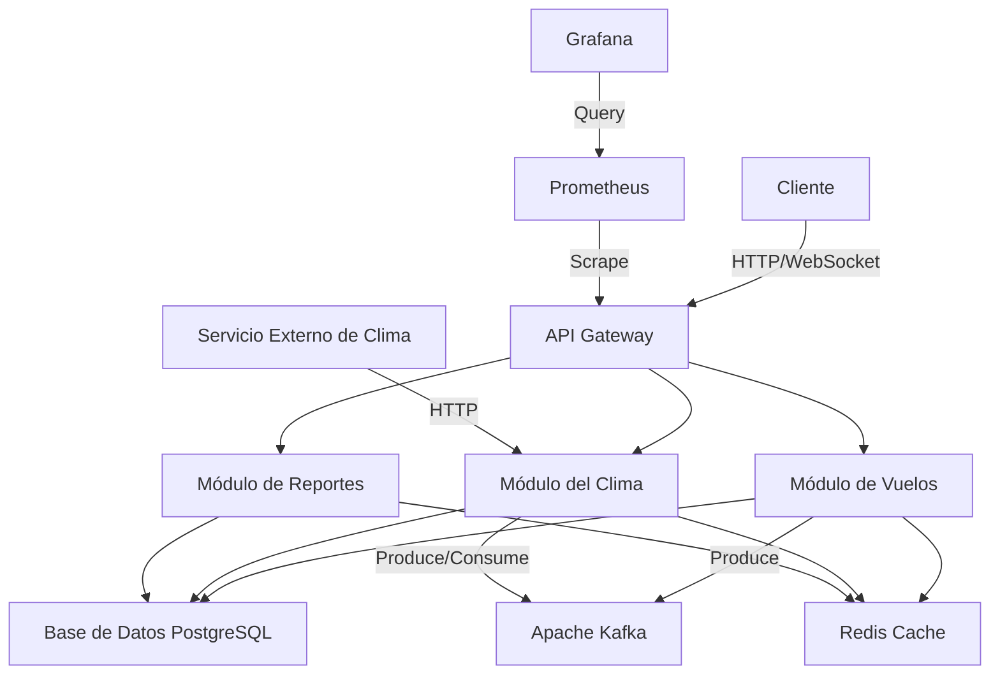
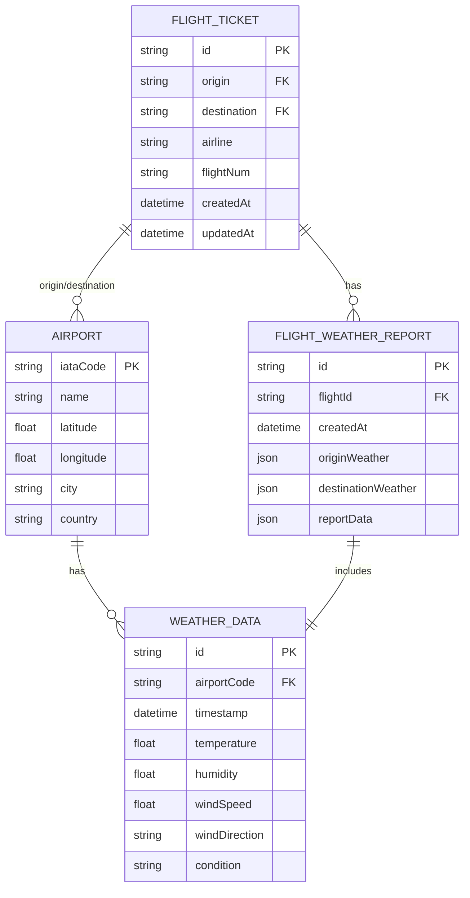

# Sistema de Información Meteorológica para Vuelos Aether


## Tabla de Contenidos

1. [Resumen Ejecutivo](#resumen-ejecutivo)
2. [Visión General del Sistema](#visión-general-del-sistema)
3. [Arquitectura del Sistema](#arquitectura-del-sistema)
   3.1 [Diagrama de Arquitectura](#diagrama-de-arquitectura)
   3.2 [Justificación de la Arquitectura](#justificación-de-la-arquitectura)
4. [Módulos Principales](#módulos-principales)
   4.1 [Módulo de Vuelos](#módulo-de-vuelos)
   4.2 [Módulo del Clima](#módulo-del-clima)
   4.3 [Módulo de Reportes](#módulo-de-reportes)
5. [Integración con Servicios Externos](#integración-con-servicios-externos)
6. [Gestión de Datos](#gestión-de-datos)
   6.1 [Modelo de Datos](#modelo-de-datos)
   6.2 [Estrategia de Caché](#estrategia-de-caché)
7. [API y Endpoints](#api-y-endpoints)
8. [Seguridad y Autenticación](#seguridad-y-autenticación)
9. [Monitoreo y Observabilidad](#monitoreo-y-observabilidad)
10. [Comunicación en Tiempo Real](#comunicación-en-tiempo-real)
11. [Configuración y Entornos](#configuración-y-entornos)
12. [Pruebas y Calidad](#pruebas-y-calidad)
13. [Despliegue y Operaciones](#despliegue-y-operaciones)
14. [Rendimiento y Optimización](#rendimiento-y-optimización)
15. [Consideraciones Futuras](#consideraciones-futuras)
16. [Glosario](#glosario)
17. [Referencias y Bibliografía](#referencias-y-bibliografía)

## 1. Resumen Ejecutivo

El Sistema de Información Meteorológica para Vuelos Aether es una solución de vanguardia diseñada para proporcionar datos meteorológicos precisos y en tiempo real para la industria de la aviación. Utilizando tecnologías de punta como NestJS, Apache Kafka, Redis, y servicios en la nube, Aether ofrece una plataforma robusta, escalable y altamente disponible para la gestión de información crítica de vuelos y condiciones meteorológicas.

Este documento proporciona una visión detallada de la arquitectura, componentes y decisiones técnicas que forman la base del sistema Aether, asegurando que cumpla con los más altos estándares de la industria y las mejores prácticas de ingeniería de software.

## 2. Visión General del Sistema

Aether es una aplicación backend modular que integra datos de vuelos con información meteorológica en tiempo real. Sus características principales incluyen:

- Gestión de información de vuelos y aeropuertos
- Obtención y procesamiento de datos meteorológicos en tiempo real
- Generación de reportes detallados de condiciones meteorológicas para rutas de vuelo
- API RESTful para integración con sistemas externos
- Procesamiento de eventos en tiempo real utilizando Apache Kafka
- Caché de alto rendimiento con Redis
- Monitoreo avanzado con Prometheus y Grafana

## 3. Arquitectura del Sistema

### 3.1 Diagrama de Arquitectura



### 3.2 Justificación de la Arquitectura

La arquitectura de Aether se basa en principios de diseño modular y microservicios, lo que permite:

1. **Escalabilidad**: Cada módulo puede escalar independientemente según la demanda.
2. **Mantenibilidad**: La separación de responsabilidades facilita el mantenimiento y la evolución del sistema.
3. **Resiliencia**: El uso de Kafka permite un acoplamiento flexible entre componentes, mejorando la tolerancia a fallos.
4. **Rendimiento**: La implementación de caché con Redis optimiza el acceso a datos frecuentes.
5. **Observabilidad**: La integración con Prometheus y Grafana proporciona monitoreo en tiempo real y análisis de tendencias.

## 4. Módulos Principales

### 4.1 Módulo de Vuelos

**Propósito**: Gestionar toda la información relacionada con vuelos y aeropuertos.

**Componentes Clave**:
- `FlightController`: Maneja las solicitudes HTTP para operaciones CRUD de vuelos.
- `FlightService`: Implementa la lógica de negocio para la gestión de vuelos.
- `FlightTicket` y `Airport`: Entidades que representan los datos principales.

**Funcionalidades**:
- Creación, lectura, actualización y eliminación de tickets de vuelo
- Búsqueda avanzada de vuelos con filtros
- Gestión de información de aeropuertos

**Ejemplo de Código**:
```typescript
@Injectable()
export class FlightService {
  constructor(
    @InjectRepository(FlightTicket)
    private readonly flightTicketRepository: Repository<FlightTicket>,
    private readonly airportService: AirportService,
    private readonly flightDataProducer: FlightDataProducer,
    private readonly cacheService: CacheService,
  ) {}

  async createFlightTicket(createFlightTicketDto: CreateFlightTicketDto): Promise<FlightTicketDto> {
    // Implementación
  }

  async searchFlights(origin?: string, destination?: string): Promise<FlightTicketDto[]> {
    // Implementación
  }
}
```

### 4.2 Módulo del Clima

**Propósito**: Obtener, procesar y proporcionar datos meteorológicos precisos.

**Componentes Clave**:
- `WeatherController`: Gestiona las solicitudes de datos meteorológicos.
- `WeatherService`: Lógica central para procesamiento de datos meteorológicos.
- `WeatherApiService`: Interactúa con APIs externas de clima.

**Funcionalidades**:
- Obtención de datos meteorológicos en tiempo real
- Caché de datos meteorológicos para mejorar el rendimiento
- Actualización periódica de datos meteorológicos

**Ejemplo de Código**:
```typescript
@Injectable()
export class WeatherService {
  constructor(
    @InjectRepository(WeatherData)
    private weatherDataRepository: Repository<WeatherData>,
    private weatherApiService: WeatherApiService,
    private redisService: RedisService,
    private weatherDataProducer: WeatherDataProducer
  ) {}

  async getWeatherForAirport(iataCode: string): Promise<WeatherData> {
    // Implementación
  }

  async updateWeatherData(weatherDataDto: WeatherDataDto): Promise<WeatherData> {
    // Implementación
  }
}
```

### 4.3 Módulo de Reportes

**Propósito**: Generar informes detallados combinando datos de vuelos y meteorológicos.

**Componentes Clave**:
- `ReportController`: Maneja solicitudes para generación y recuperación de informes.
- `ReportService`: Lógica para la creación de informes.
- `FlightWeatherReport`: Entidad que representa un informe.

**Funcionalidades**:
- Generación de informes bajo demanda
- Programación de generación automática de informes
- Almacenamiento y recuperación de informes históricos

**Ejemplo de Código**:
```typescript
@Injectable()
export class ReportService {
  constructor(
    @InjectRepository(FlightWeatherReport)
    private flightWeatherReportRepository: Repository<FlightWeatherReport>,
    private flightService: FlightService,
    private weatherService: WeatherService,
  ) {}

  async generateReport(flightId: string): Promise<FlightWeatherReportDto> {
    // Implementación
  }
}
```

## 5. Integración con Servicios Externos

### Apache Kafka

Aether utiliza Apache Kafka para el procesamiento de eventos y la comunicación asíncrona entre servicios.

**Justificación**: Kafka proporciona un sistema de mensajería distribuido de alto rendimiento que permite el desacoplamiento de componentes y el procesamiento de eventos en tiempo real.

**Implementación**:
- `KafkaModule`: Configura la conexión y los productores/consumidores de Kafka.
- `WeatherDataProducer` y `FlightDataProducer`: Publican eventos a temas específicos de Kafka.
- `WeatherDataConsumer`: Consume y procesa eventos de datos meteorológicos.

**Ejemplo de Código**:
```typescript
@Injectable()
export class WeatherDataProducer implements OnModuleInit, OnModuleDestroy {
  private producer: KafkaJS.Producer;

  constructor(private configService: ConfigService) {
    // Inicialización
  }

  async publishWeatherData(weatherData: WeatherData): Promise<void> {
    // Implementación
  }
}
```

### Servicio Externo de Clima

Aether se integra con servicios externos de pronóstico del tiempo para obtener datos meteorológicos actualizados.

**Implementación**:
- `WeatherApiService`: Gestiona las llamadas a la API externa del servicio meteorológico.

**Ejemplo de Código**:
```typescript
@Injectable()
export class WeatherApiService {
  constructor(
    private httpService: HttpService,
    private configService: ConfigService,
  ) {}

  async fetchWeatherData(iataCode: string): Promise<WeatherData> {
    // Implementación
  }
}
```

## 6. Gestión de Datos

### 6.1 Modelo de Datos

Aether utiliza TypeORM como ORM (Object-Relational Mapping) para interactuar con la base de datos PostgreSQL.

**Entidades Principales**:
- `FlightTicket`: Representa un ticket de vuelo.
- `Airport`: Almacena información sobre aeropuertos.
- `WeatherData`: Contiene datos meteorológicos para un aeropuerto en un momento específico.
- `FlightWeatherReport`: Representa un informe meteorológico para un vuelo específico.

**Diagrama de Entidad-Relación**:



### 6.2 Estrategia de Caché

Aether implementa una estrategia de caché utilizando Redis para mejorar el rendimiento y reducir la carga en la base de datos.

**Justificación**: Redis proporciona un almacenamiento en memoria de alta velocidad, ideal para cachear datos frecuentemente accedidos como información meteorológica reciente.

**Implementación**:
- `CacheService`: Proporciona métodos para interactuar con Redis.
- Uso de caché en servicios críticos como `WeatherService` y `FlightService`.

**Ejemplo de Código**:
```typescript
@Injectable()
export class CacheService {
  constructor(private readonly redisService: RedisService) {}

  async getFlightTicket(id: string): Promise<FlightTicketDto | null> {
    // Implementación
  }

  async setFlightTicket(id: string, ticket: FlightTicketDto, ttl: number = 3600): Promise<void> {
    // Implementación
  }
}
```

## 7. API y Endpoints

Aether expone una API RESTful para interactuar con el sistema. Los principales endpoints incluyen:

### Vuelos
- `GET /flights`: Obtener lista de vuelos
- `POST /flights`: Crear un nuevo vuelo
- `GET /flights/:id`: Obtener detalles de un vuelo específico
- `PUT /flights/:id`: Actualizar un vuelo
- `DELETE /flights/:id`: Eliminar un vuelo

### Clima
- `GET /weather/:iataCode`: Obtener datos meteorológicos para un aeropuerto

### Reportes
- `POST /reports/:flightId`: Generar un informe meteorológico para un vuelo
- `GET /reports/:id`: Obtener un informe específico

**Documentación de API**: 
La documentación detallada de la API se genera automáticamente utilizando Swagger y está disponible en `/api-docs` cuando la aplicación está en ejecución.

## 8. Seguridad y Autenticación

Aether implementa múltiples capas de seguridad para proteger los datos y garantizar el acceso autorizado.

### Autenticación

Se utiliza autenticación basada en JWT (JSON Web Tokens) para securizar el acceso a la API.

**Implementación**:
- Middleware de autenticación que valida los tokens JWT en las solicitudes entrantes.
- Generación de tokens JWT al iniciar sesión.

### Autorización

El sistema implementa un sistema de roles y permisos para controlar el acceso a diferentes funcionalidades.

**Implementación**:
- Decoradores personalizados para verificar roles y permisos en los controladores.
- Almacenamiento de roles de usuario en la base de datos.

### Protección contra Ataques

- **Rate Limiting**: Se implementa limitación de tasa para prevenir abusos de la API.
- **HTTPS**: Todas las comunicaciones
Ciertamente, continuaré desde donde me quedé en la sección de Seguridad y Autenticación.

### Protección contra Ataques (continuación)

- **HTTPS**: Todas las comunicaciones se realizan sobre HTTPS para garantizar la encriptación de datos en tránsito.
- **Validación de Entrada**: Se implementa una validación rigurosa de todas las entradas de usuario para prevenir ataques de inyección y XSS.
- **Encriptación de Datos Sensibles**: Los datos sensibles se almacenan encriptados en la base de datos.

**Ejemplo de Código (Middleware de Autenticación)**:
```typescript
@Injectable()
export class JwtAuthGuard implements CanActivate {
  constructor(private jwtService: JwtService) {}

  async canActivate(context: ExecutionContext): Promise<boolean> {
    const request = context.switchToHttp().getRequest();
    const token = this.extractTokenFromHeader(request);
    if (!token) {
      throw new UnauthorizedException();
    }
    try {
      const payload = await this.jwtService.verifyAsync(token);
      request['user'] = payload;
    } catch {
      throw new UnauthorizedException();
    }
    return true;
  }

  private extractTokenFromHeader(request: Request): string | undefined {
    const [type, token] = request.headers.authorization?.split(' ') ?? [];
    return type === 'Bearer' ? token : undefined;
  }
}
```

## 9. Monitoreo y Observabilidad

Aether implementa un sistema robusto de monitoreo y observabilidad para garantizar la salud y el rendimiento del sistema.

### Prometheus

Se utiliza Prometheus para la recolección y almacenamiento de métricas.

**Justificación**: Prometheus proporciona un sistema potente y flexible para la recolección de métricas, con capacidades de alerta y una amplia gama de exportadores.

**Implementación**:
- `PrometheusModule`: Configura la integración con Prometheus.
- `PrometheusService`: Define y expone métricas personalizadas.

**Ejemplo de Código**:
```typescript
@Injectable()
export class PrometheusService {
  private readonly messagesProcessed: Counter;

  constructor() {
    this.messagesProcessed = new Counter({
      name: 'kafka_messages_processed_total',
      help: 'Total number of Kafka messages processed',
      labelNames: ['topic'],
    });
  }

  incrementMessageProcessed(topic: string): void {
    this.messagesProcessed.labels(topic).inc();
  }
}
```

### Logging

Se implementa un sistema de logging estructurado para facilitar el análisis y la depuración.

**Implementación**:
- Utilización de Winston para logging estructurado.
- Integración con servicios de log aggregation como ELK Stack (Elasticsearch, Logstash, Kibana) para análisis centralizado de logs.

**Ejemplo de Código**:
```typescript
export class Logger implements LoggerService {
  private logger: winston.Logger;

  constructor(context?: string) {
    this.logger = winston.createLogger({
      level: process.env.LOG_LEVEL || 'info',
      format: winston.format.combine(
        winston.format.timestamp(),
        winston.format.json()
      ),
      defaultMeta: { service: 'aether-backend', context },
      transports: [
        new winston.transports.Console(),
        new winston.transports.File({ filename: 'error.log', level: 'error' }),
        new winston.transports.File({ filename: 'combined.log' })
      ]
    });
  }

  log(message: string) {
    this.logger.info(message);
  }

  error(message: string, trace: string) {
    this.logger.error(message, { trace });
  }
}
```

## 10. Comunicación en Tiempo Real

Aether utiliza WebSockets para proporcionar actualizaciones en tiempo real a los clientes conectados.

**Justificación**: WebSockets permiten una comunicación bidireccional en tiempo real entre el servidor y los clientes, ideal para notificaciones instantáneas sobre cambios en vuelos o condiciones meteorológicas.

**Implementación**:
- `WebSocketService`: Maneja las conexiones y comunicaciones por WebSocket.
- `NotificationService`: Envía notificaciones a los clientes conectados.

**Ejemplo de Código**:
```typescript
@Injectable()
export class WebSocketService {
  private server: Server;

  setServer(server: Server) {
    this.server = server;
    this.setupConnectionHandlers();
  }

  private setupConnectionHandlers() {
    this.server.on('connection', (socket: Socket) => {
      console.log(`Client connected: ${socket.id}`);

      socket.on('disconnect', () => {
        console.log(`Client disconnected: ${socket.id}`);
      });
    });
  }

  sendToAll(event: string, data: any) {
    this.server.emit(event, data);
  }
}
```

## 11. Configuración y Entornos

Aether utiliza un sistema de configuración basado en archivos y variables de entorno para manejar diferentes entornos (desarrollo, pruebas, producción).

**Implementación**:
- Uso de `@nestjs/config` para cargar y gestionar la configuración.
- Archivos de configuración específicos para diferentes aspectos del sistema (base de datos, Kafka, Redis, etc.).

**Ejemplo de Código (database.config.ts)**:
```typescript
import { registerAs } from '@nestjs/config';
import { TypeOrmModuleOptions } from '@nestjs/typeorm';

export default registerAs('database', (): TypeOrmModuleOptions => ({
  type: 'postgres',
  host: process.env.DB_HOST,
  port: parseInt(process.env.DB_PORT, 10) || 5432,
  username: process.env.DB_USERNAME,
  password: process.env.DB_PASSWORD,
  database: process.env.DB_NAME,
  entities: ['dist/**/*.entity{.ts,.js}'],
  synchronize: process.env.NODE_ENV !== 'production',
  logging: process.env.NODE_ENV === 'development',
}));
```

## 12. Pruebas y Calidad

Aether implementa una estrategia integral de pruebas para garantizar la calidad y confiabilidad del sistema.

### Tipos de Pruebas

1. **Pruebas Unitarias**: Prueban componentes individuales de forma aislada.
2. **Pruebas de Integración**: Verifican la interacción correcta entre diferentes módulos.
3. **Pruebas End-to-End (E2E)**: Prueban flujos completos de la aplicación.

**Implementación**:
- Uso de Jest como framework principal de pruebas.
- Implementación de pruebas unitarias para servicios y controladores.
- Pruebas de integración para verificar la interacción con servicios externos y base de datos.
- Pruebas E2E utilizando Supertest para simular solicitudes HTTP.

**Ejemplo de Código (Prueba Unitaria)**:
```typescript
describe('FlightService', () => {
  let service: FlightService;
  let repository: MockType<Repository<FlightTicket>>;

  beforeEach(async () => {
    const module: TestingModule = await Test.createTestingModule({
      providers: [
        FlightService,
        { provide: getRepositoryToken(FlightTicket), useFactory: repositoryMockFactory },
      ],
    }).compile();

    service = module.get<FlightService>(FlightService);
    repository = module.get(getRepositoryToken(FlightTicket));
  });

  it('should be defined', () => {
    expect(service).toBeDefined();
  });

  it('should create a flight ticket', async () => {
    const flightTicketDto = { /* ... */ };
    repository.save.mockReturnValue(flightTicketDto);
    expect(await service.createFlightTicket(flightTicketDto)).toEqual(flightTicketDto);
  });
});
```

## 13. Despliegue y Operaciones

Aether está diseñado para ser desplegado en contenedores Docker, facilitando la implementación y escalado en diferentes entornos.

### Containerización

- Uso de Docker para empaquetar la aplicación y sus dependencias.
- Dockerfile optimizado para minimizar el tamaño de la imagen y mejorar la seguridad.

**Ejemplo de Dockerfile**:
```dockerfile
FROM node:14-alpine AS builder
WORKDIR /app
COPY package*.json ./
RUN npm ci
COPY . .
RUN npm run build

FROM node:14-alpine
WORKDIR /app
COPY --from=builder /app/dist ./dist
COPY --from=builder /app/node_modules ./node_modules
EXPOSE 3030
CMD ["node", "dist/main"]
```

### Orquestación

- Uso de Kubernetes para orquestación de contenedores en producción.
- Implementación de Helm charts para facilitar el despliegue y la gestión de la aplicación en Kubernetes.

### CI/CD

- Implementación de pipelines de CI/CD utilizando GitLab CI o GitHub Actions.
- Automatización de pruebas, construcción de imágenes Docker y despliegue en diferentes entornos.

**Ejemplo de Pipeline de GitLab CI**:
```yaml
stages:
  - test
  - build
  - deploy

test:
  stage: test
  script:
    - npm ci
    - npm run test

build:
  stage: build
  script:
    - docker build -t aether-backend:$CI_COMMIT_SHA .
    - docker push aether-backend:$CI_COMMIT_SHA

deploy:
  stage: deploy
  script:
    - kubectl set image deployment/aether-backend aether-backend=aether-backend:$CI_COMMIT_SHA
```

## 14. Rendimiento y Optimización

Aether implementa varias estrategias para optimizar el rendimiento y la eficiencia del sistema:

1. **Caché Distribuida**: Uso de Redis para cachear datos frecuentemente accedidos, reduciendo la carga en la base de datos.
2. **Indexación de Base de Datos**: Implementación de índices apropiados en PostgreSQL para optimizar las consultas frecuentes.
3. **Procesamiento Asíncrono**: Uso de Kafka para procesar tareas pesadas de manera asíncrona, mejorando los tiempos de respuesta de la API.
4. **Optimización de Consultas**: Uso de consultas optimizadas y eager loading en TypeORM para reducir el número de consultas a la base de datos.
5. **Compresión de Respuestas**: Implementación de compresión gzip para respuestas HTTP, reduciendo el ancho de banda necesario.

**Ejemplo de Optimización de Consulta**:
```typescript
@Injectable()
export class FlightService {
  async getFlightWithDetails(id: string): Promise<FlightTicket> {
    return this.flightTicketRepository.createQueryBuilder('flight')
      .leftJoinAndSelect('flight.originAirport', 'origin')
      .leftJoinAndSelect('flight.destinationAirport', 'destination')
      .where('flight.id = :id', { id })
      .getOne();
  }
}
```

## 15. Consideraciones Futuras

Para el desarrollo futuro de Aether, se consideran las siguientes áreas de mejora y expansión:

1. **Implementación de GraphQL**: Para proporcionar una API más flexible y eficiente.
2. **Integración con Machine Learning**: Para mejorar las predicciones meteorológicas y la optimización de rutas.
3. **Expansión de Microservicios**: Dividir el sistema en microservicios más granulares para mejorar la escalabilidad y el mantenimiento.
4. **Implementación de Event Sourcing**: Para mejorar la trazabilidad y permitir reconstrucción de estados pasados del sistema.
5. **Internacionalización**: Soporte para múltiples idiomas en la interfaz de usuario y los informes.

## 16. Glosario

- **IATA**: Asociación de Transporte Aéreo Internacional
- **JWT**: JSON Web Token
- **ORM**: Object-Relational Mapping
- **API**: Application Programming Interface
- **WebSocket**: Protocolo de comunicación bidireccional en tiempo real
- **Kafka**: Plataforma de streaming de eventos distribuidos
- **Redis**: Sistema de almacenamiento de estructura de datos en memoria
- **Prometheus**: Sistema de monitoreo y alerta de código abierto

## 17. Referencias y Bibliografía

1. NestJS Documentation. (2021). Retrieved from https://docs.nestjs.com/
2. TypeORM Documentation. (2021). Retrieved from https://typeorm.io/
3. Apache Kafka Documentation. (2021). Retrieved from https://kafka.apache.org/documentation/
4. Redis Documentation. (2021). Retrieved from https://redis.io/documentation
5. Prometheus Documentation. (2021). Retrieved from https://prometheus.io/docs/introduction/overview/
6. Martin Fowler. (2014). Microservices. Retrieved from https://martinfowler.com/articles/microservices.html
7. Chris Richardson. (2018). Microservices Patterns. Manning Publications.
8. Nygard, M. T. (2007). Release It!: Design and Deploy Production-Ready Software. Pragmatic Bookshelf.
9. Newman, S. (2015). Building Microservices: Designing Fine-Grained Systems. O'Reilly Media.
10. Kleppmann, M. (2017). Designing Data-Intensive Applications. O'Reilly Media.