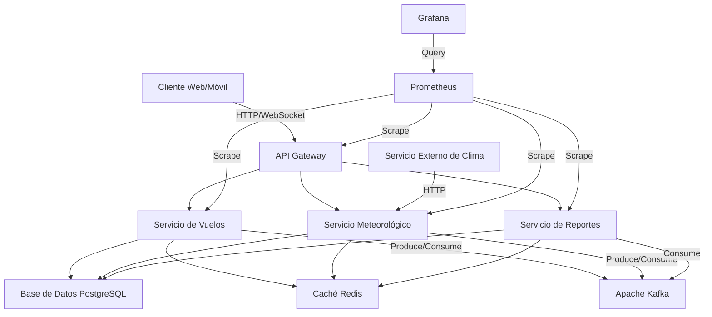

# Aether Flight Weather Information System: Arquitectura del Sistema

## Resumen Ejecutivo

El Sistema de Información Meteorológica para Vuelos Aether es una plataforma de vanguardia diseñada para proporcionar datos meteorológicos precisos y en tiempo real para la industria de la aviación. Este documento detalla la arquitectura del sistema, las decisiones de diseño y las justificaciones técnicas que respaldan estas elecciones.

## Tabla de Contenidos

1. [Introducción](#1-introducción)
2. [Visión General de la Arquitectura](#2-visión-general-de-la-arquitectura)
3. [Componentes Arquitectónicos](#3-componentes-arquitectónicos)
4. [Patrones Arquitectónicos](#4-patrones-arquitectónicos)
5. [Decisiones Arquitectónicas Clave](#5-decisiones-arquitectónicas-clave)
6. [Escalabilidad y Rendimiento](#6-escalabilidad-y-rendimiento)
7. [Seguridad](#7-seguridad)
8. [Integración y Comunicación](#8-integración-y-comunicación)
9. [Manejo de Datos](#9-manejo-de-datos)
10. [Observabilidad y Monitoreo](#10-observabilidad-y-monitoreo)
11. [Despliegue y DevOps](#11-despliegue-y-devops)
12. [Evolución Futura](#12-evolución-futura)
13. [Glosario](#13-glosario)
14. [Referencias](#14-referencias)

## 1. Introducción

### 1.1 Propósito
Este documento describe la arquitectura del Sistema de Información Meteorológica para Vuelos Aether, proporcionando una visión detallada de su estructura, componentes y decisiones de diseño.

### 1.2 Alcance
El documento cubre todos los aspectos arquitectónicos del sistema Aether, desde la infraestructura hasta la capa de presentación.

### 1.3 Audiencia
Este documento está dirigido a arquitectos de software, desarrolladores, ingenieros de DevOps y stakeholders técnicos involucrados en el desarrollo y mantenimiento del sistema Aether.

## 2. Visión General de la Arquitectura

Aether está construido sobre una arquitectura de microservicios, adoptando principios de Diseño Dirigido por el Dominio (DDD) y Arquitectura Limpia.

### 2.1 Diagrama de Arquitectura de Alto Nivel



### 2.2 Justificación de la Arquitectura

La arquitectura de microservicios se eligió por las siguientes razones clave:

1. **Escalabilidad**: Permite escalar componentes individuales según la demanda [1].
2. **Flexibilidad tecnológica**: Cada servicio puede utilizar la tecnología más adecuada para su función [2].
3. **Resiliencia**: El aislamiento de servicios previene que fallos en un componente afecten a todo el sistema [3].
4. **Desarrollo y despliegue independientes**: Facilita la entrega continua y el despliegue independiente de servicios [4].

## 3. Componentes Arquitectónicos

### 3.1 Capa de Presentación
- **API Gateway**: Implementado con NestJS, maneja la autenticación, autorización y enrutamiento de solicitudes.
- **WebSocket Server**: Proporciona actualizaciones en tiempo real a los clientes.

### 3.2 Capa de Aplicación
- **Servicio de Vuelos**: Gestiona la información de vuelos y aeropuertos.
- **Servicio Meteorológico**: Procesa y proporciona datos meteorológicos.
- **Servicio de Reportes**: Genera informes combinando datos de vuelos y meteorológicos.

### 3.3 Capa de Dominio
- **Entidades de Dominio**: `FlightTicket`, `Airport`, `WeatherData`, `FlightWeatherReport`.
- **Servicios de Dominio**: Implementan la lógica de negocio central.

### 3.4 Capa de Infraestructura
- **Base de Datos**: PostgreSQL para almacenamiento persistente.
- **Caché**: Redis para almacenamiento en memoria de datos frecuentemente accedidos.
- **Mensajería**: Apache Kafka para comunicación asíncrona entre servicios.
- **Monitoreo**: Prometheus y Grafana para recolección de métricas y visualización.

## 4. Patrones Arquitectónicos

### 4.1 Patrón Repository
Utilizado para abstraer el acceso a datos [5].

#### Ejemplo de Implementación

```typescript
@Injectable()
export class FlightRepository {
  constructor(
    @InjectRepository(FlightTicket)
    private readonly repository: Repository<FlightTicket>,
  ) {}

  async findById(id: string): Promise<FlightTicket> {
    return this.repository.findOne({ where: { id } });
  }

  async create(flightData: CreateFlightTicketDto): Promise<FlightTicket> {
    const flight = this.repository.create(flightData);
    return this.repository.save(flight);
  }

  // Más métodos...
}
```

### 4.2 Patrón CQRS
Implementado para separar las operaciones de lectura y escritura en ciertos componentes [6].

### 4.3 Event Sourcing
Utilizado para capturar cambios de estado como una secuencia de eventos [7].

## 5. Decisiones Arquitectónicas Clave

### 5.1 Uso de NestJS
**Decisión**: Utilizar NestJS como framework principal para el backend.
**Justificación**: Proporciona una arquitectura escalable out-of-the-box y facilita la implementación de principios SOLID [8].

### 5.2 Base de Datos PostgreSQL
**Decisión**: Utilizar PostgreSQL como base de datos principal.
**Justificación**: Ofrece robustez y soporte para datos geoespaciales, necesarios para manejar eficientemente datos de ubicación de aeropuertos y rutas de vuelo [9].

### 5.3 Caché con Redis
**Decisión**: Implementar Redis como sistema de caché.
**Justificación**: Reduce la carga en la base de datos y mejora la latencia para datos frecuentemente accedidos [10].

### 5.4 Apache Kafka para Mensajería
**Decisión**: Utilizar Apache Kafka para la comunicación asíncrona entre servicios.
**Justificación**: Permite un desacoplamiento efectivo entre servicios y soporta el procesamiento de streams de datos en tiempo real [11].

## 6. Escalabilidad y Rendimiento

### 6.1 Estrategias de Escalabilidad
- **Escalado Horizontal**: Cada microservicio puede escalar independientemente.
- **Caché Distribuida**: Implementada con Redis para reducir la latencia y la carga en la base de datos.
- **Procesamiento Asíncrono**: Utilización de Kafka para manejar cargas de trabajo intensivas de manera asíncrona.

### 6.2 Optimización del Rendimiento
#### Ejemplo de Estrategia de Caché

```typescript
@Injectable()
export class WeatherService {
  constructor(
    private readonly cacheManager: Cache,
    private readonly weatherRepository: WeatherRepository,
  ) {}

  async getWeatherForAirport(iataCode: string): Promise<WeatherData> {
    const cacheKey = `weather:${iataCode}`;
    const cachedData = await this.cacheManager.get(cacheKey);
    
    if (cachedData) {
      return cachedData;
    }

    const weatherData = await this.weatherRepository.getLatestForAirport(iataCode);
    await this.cacheManager.set(cacheKey, weatherData, { ttl: 300 });
    
    return weatherData;
  }
}
```

## 7. Seguridad

### 7.1 Autenticación y Autorización
- Implementación de JSON Web Tokens (JWT) para autenticar solicitudes.
- Control de acceso basado en roles (RBAC) para diferentes endpoints y recursos.

### 7.2 Encriptación
- Datos sensibles encriptados en reposo y en tránsito.

### 7.3 Protección contra Ataques
- Rate Limiting implementado en el API Gateway para prevenir abusos.

#### Ejemplo de Middleware de Autenticación

```typescript
@Injectable()
export class JwtAuthGuard implements CanActivate {
  constructor(private jwtService: JwtService) {}

  async canActivate(context: ExecutionContext): Promise<boolean> {
    const request = context.switchToHttp().getRequest();
    const token = this.extractTokenFromHeader(request);
    if (!token) {
      throw new UnauthorizedException();
    }
    try {
      const payload = await this.jwtService.verifyAsync(token);
      request['user'] = payload;
    } catch {
      throw new UnauthorizedException();
    }
    return true;
  }

  private extractTokenFromHeader(request: Request): string | undefined {
    const [type, token] = request.headers.authorization?.split(' ') ?? [];
    return type === 'Bearer' ? token : undefined;
  }
}
```

## 8. Integración y Comunicación

### 8.1 API RESTful
Implementada utilizando NestJS para comunicación síncrona entre clientes y el backend.

### 8.2 WebSockets
Utilizados para proporcionar actualizaciones en tiempo real a los clientes.

### 8.3 Apache Kafka
Empleado para la comunicación asíncrona entre microservicios.

#### Ejemplo de Productor Kafka con Confluent

```typescript
import { Kafka, Producer } from 'kafkajs';
import { SchemaRegistry } from '@kafkajs/confluent-schema-registry';

@Injectable()
export class WeatherUpdateProducer {
  private producer: Producer;
  private schemaRegistry: SchemaRegistry;

  constructor() {
    const kafka = new Kafka({
      clientId: 'aether-weather-service',
      brokers: ['localhost:9092'],
    });
    this.producer = kafka.producer();
    this.schemaRegistry = new SchemaRegistry({ host: 'http://localhost:8081' });
  }

  async sendWeatherUpdate(weatherData: WeatherData): Promise<void> {
    const schemaId = await this.schemaRegistry.getLatestSchemaId('weather-value');
    const encodedValue = await this.schemaRegistry.encode(schemaId, weatherData);

    await this.producer.send({
      topic: 'weather-updates',
      messages: [
        { 
          key: weatherData.airportCode, 
          value: encodedValue
        },
      ],
    });
  }
}
```

## 9. Manejo de Datos

### 9.1 ORM
Uso de TypeORM para mapeo objeto-relacional.

### 9.2 Migraciones
Implementadas para gestionar cambios en el esquema de la base de datos.

### 9.3 Transacciones
Utilizadas para garantizar la consistencia de los datos en operaciones complejas.

#### Ejemplo de Entidad y Migración

```typescript
// Entidad
@Entity('flight_tickets')
export class FlightTicket {
  @PrimaryGeneratedColumn('uuid')
  id: string;

  @Column()
  flightNumber: string;

  @ManyToOne(() => Airport)
  origin: Airport;

  @ManyToOne(() => Airport)
  destination: Airport;

  // Más campos...
}

// Migración
export class CreateFlightTicketTable1635000000000 implements MigrationInterface {
  public async up(queryRunner: QueryRunner): Promise<void> {
    await queryRunner.createTable(
      new Table({
        name: 'flight_tickets',
        columns: [
          {
            name: 'id',
            type: 'uuid',
            isPrimary: true,
            generationStrategy: 'uuid',
            default: 'uuid_generate_v4()',
          },
          {
            name: 'flight_number',
            type: 'varchar',
          },
          // Más columnas...
        ],
      }),
      true,
    );
  }

  public async down(queryRunner: QueryRunner): Promise<void> {
    await queryRunner.dropTable('flight_tickets');
  }
}
```

## 10. Observabilidad y Monitoreo

### 10.1 Logging
Implementación de logging estructurado con Winston.

### 10.2 Métricas
Recolección de métricas con Prometheus.

### 10.3 Tracing
Implementación de tracing distribuido con Jaeger.

#### Ejemplo de Configuración de Prometheus

```typescript
import { PrometheusModule } from '@willsoto/nestjs-prometheus';

@Module({
  imports: [
    PrometheusModule.register({
      defaultMetrics: {
        enabled: true,
      },
      path: '/metrics',
    }),
  ],
})
export class AppModule {}
```

## 11. Despliegue y DevOps

### 11.1 Containerización
Uso de Docker para empaquetar servicios.

### 11.2 Orquestación
Kubernetes para gestionar el despliegue y escalado de contenedores.

### 11.3 CI/CD
Implementación de pipelines con GitLab CI para integración y despliegue continuos.

#### Ejemplo de Dockerfile

```dockerfile
FROM node:14-alpine AS builder
WORKDIR /app
COPY package*.json ./
RUN npm ci
COPY . .
RUN npm run build

FROM node:14-alpine
WORKDIR /app
COPY --from=builder /app/dist ./dist
COPY --from=builder /app/node_modules ./node_modules
EXPOSE 3000
CMD ["node", "dist/main"]
```

## 12. Evolución Futura

- Implementación de GraphQL para consultas más flexibles.
- Integración de machine learning para predicciones meteorológicas avanzadas.
- Expansión a una arquitectura de microservicios más granular.

## 13. Glosario

- **API Gateway**: Punto de entrada único para todas las solicitudes de clientes.
- **CQRS**: Command Query Responsibility Segregation, un patrón que separa las operaciones de lectura y escritura.
- **DDD**: Domain-Driven Design, un enfoque de diseño de software que se centra en el dominio del negocio.
- **Event Sourcing**: Un patrón de diseño donde los cambios de estado se capturan como una secuencia de eventos.
- **JWT**: JSON Web Token, un estándar abierto para crear tokens de acceso.
- **Kubernetes**: Una plataforma de código abierto para automatizar el despliegue, escalado y gestión de aplicaciones en contenedores.
- **Microservicio**: Una arquitectura que estructura una aplicación como una colección de servicios débilmente acoplados.
- **ORM**: Object-Relational Mapping, una técnica de programación para convertir datos entre sistemas de tipos incompatibles.
- **RBAC**: Role-Based Access Control, un método de regular el acceso a recursos del sistema basado en roles de usuarios.
- **WebSocket**: Un protocolo de comunicación que proporciona canales de comunicación full-duplex sobre una única conexión TCP.

## 14. Referencias

[1] Newman, S. (2015). Building Microservices: Designing Fine-Grained Systems. O'Reilly Media.

[2] Richards, M. (2015). Software Architecture Patterns. O'Reilly Media.

[3] Nygard, M. T. (2007). Release It!: Design and Deploy Production-Ready Software. Pragmatic Bookshelf.

[4] Fowler, M. (2014). Microservices. https://martinfowler.com/articles/microservices.html

[5] Evans, E. (2003). Domain-Driven Design: Tackling Complexity in the Heart of Software. Addison-Wesley.

[6] Young, G. (2010). CQRS Documents by Greg Young. https://cqrs.files.wordpress.com/2010/11/cqrs_documents.pdf

[7] Betts, D. et al. (2012). Exploring CQRS and Event Sourcing. Microsoft patterns & practices.

[8] NestJS. (2021). Documentation. https://docs.nestjs.com/

[9] PostgreSQL Global Development Group. (2021). PostgreSQL Documentation. https://www.postgresql.org/docs/

[10] Redis Labs. (2021). Redis Documentation. https://redis.io/documentation

[11] Apache Software Foundation. (2021). Apache Kafka Documentation. https://kafka.apache.org/documentation/

[12] Kleppmann, M. (2017). Designing Data-Intensive Applications. O'Reilly Media.

[13] Burns, B. et al. (2019). Kubernetes: Up and Running: Dive into the Future of Infrastructure. O'Reilly Media.

[14] Confluent. (2021). Confluent Platform. https://www.confluent.io/product/confluent-platform/

[15] Confluent. (2021). Confluent Schema Registry. https://docs.confluent.io/platform/current/schema-registry/index.html

[16] Confluent. (2021). Confluent Cloud. https://www.confluent.io/confluent-cloud/

[17] Socket.io. (2021). Socket.IO Documentation. https://socket.io/docs/v4/

[18] NestJS. (2021). Gateways - NestJS Documentation. https://docs.nestjs.com/websockets/gateways

[19] Fowler, M. (2017). What do you mean by "Event-Driven"? https://martinfowler.com/articles/201701-event-driven.html

[20] Stopford, B. (2017). Designing Event-Driven Systems. O'Reilly Media.