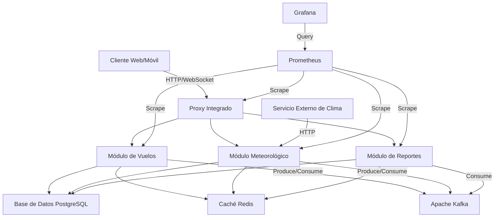

# Aether Flight Weather Information System: Arquitectura del Sistema

## Resumen Ejecutivo

El Sistema de Información Meteorológica para Vuelos Aether es una plataforma de vanguardia diseñada para proporcionar datos meteorológicos precisos y en tiempo real para la industria de la aviación. Este documento detalla la arquitectura del sistema, las decisiones de diseño y las justificaciones técnicas que respaldan estas elecciones, con un enfoque en la modularidad, los principios SOLID y la integración eficiente de componentes.

## Tabla de Contenidos

1. [Introducción](#1-introducción)
2. [Visión General de la Arquitectura](#2-visión-general-de-la-arquitectura)
3. [Componentes Arquitectónicos](#3-componentes-arquitectónicos)
4. [Patrones Arquitectónicos y Principios SOLID](#4-patrones-arquitectónicos-y-principios-solid)
5. [Decisiones Arquitectónicas Clave](#5-decisiones-arquitectónicas-clave)
6. [Escalabilidad y Rendimiento](#6-escalabilidad-y-rendimiento)
7. [Integración y Comunicación](#7-integración-y-comunicación)
8. [Manejo de Datos](#8-manejo-de-datos)
9. [Observabilidad y Monitoreo](#9-observabilidad-y-monitoreo)
10. [Despliegue y DevOps](#10-despliegue-y-devops)
11. [Evolución Futura](#11-evolución-futura)
12. [Glosario](#12-glosario)
13. [Referencias](#13-referencias)

## 1. Introducción

[El contenido de esta sección permanece sin cambios]

## 2. Visión General de la Arquitectura

Aether está construido sobre una arquitectura modular, adoptando principios de Diseño Dirigido por el Dominio (DDD), Arquitectura Limpia y SOLID.

### 2.1 Diagrama de Arquitectura de Alto Nivel



### 2.2 Justificación de la Arquitectura

La arquitectura modular con principios SOLID se eligió por las siguientes razones clave:

1. **Modularidad**: Permite una clara separación de responsabilidades y facilita el mantenimiento [1].
2. **Flexibilidad**: Cada módulo puede evolucionar independientemente, facilitando la adaptación a cambios [2].
3. **Testabilidad**: La estructura modular y los principios SOLID fomentan un diseño más fácil de probar [3].
4. **Reutilización**: Los módulos bien diseñados pueden reutilizarse en diferentes partes del sistema o en otros proyectos [4].
5. **Escalabilidad**: Permite escalar componentes individuales según la demanda [5].

## 3. Componentes Arquitectónicos

### 3.1 Capa de Presentación
- **Proxy Integrado**: Maneja el enrutamiento de solicitudes y la comunicación con los módulos internos.
- **WebSocket Server**: Proporciona actualizaciones en tiempo real a los clientes.

### 3.2 Módulos de Aplicación
- **Módulo de Vuelos**: Gestiona la información de vuelos y aeropuertos.
- **Módulo Meteorológico**: Procesa y proporciona datos meteorológicos.
- **Módulo de Reportes**: Genera informes combinando datos de vuelos y meteorológicos.

### 3.3 Capa de Dominio
- **Entidades de Dominio**: `FlightTicket`, `Airport`, `WeatherData`, `FlightWeatherReport`.
- **Servicios de Dominio**: Implementan la lógica de negocio central.

### 3.4 Capa de Infraestructura
- **Base de Datos**: PostgreSQL para almacenamiento persistente.
- **Caché**: Redis para almacenamiento en memoria de datos frecuentemente accedidos.
- **Mensajería**: Apache Kafka para comunicación asíncrona entre servicios.
- **Monitoreo**: Prometheus y Grafana para recolección de métricas y visualización.

## 4. Patrones Arquitectónicos y Principios SOLID

### 4.1 Patrón Repository
Utilizado para abstraer el acceso a datos [6].

#### Ejemplo de Implementación

```typescript
@Injectable()
export class FlightRepository {
  constructor(
    @InjectRepository(FlightTicket)
    private readonly repository: Repository<FlightTicket>,
  ) {}

  async findById(id: string): Promise<FlightTicket> {
    return this.repository.findOne({ where: { id } });
  }

  async create(flightData: CreateFlightTicketDto): Promise<FlightTicket> {
    const flight = this.repository.create(flightData);
    return this.repository.save(flight);
  }

  // Más métodos...
}
```

### 4.2 Principio de Responsabilidad Única (SRP)
Cada módulo tiene una responsabilidad única y bien definida.

### 4.3 Principio de Abierto/Cerrado (OCP)
Los módulos están diseñados para ser extendidos sin modificar su código existente.

### 4.4 Principio de Sustitución de Liskov (LSP)
Las implementaciones concretas pueden sustituir a sus abstracciones sin afectar el comportamiento del sistema.

### 4.5 Principio de Segregación de Interfaces (ISP)
Se utilizan interfaces específicas para cada tipo de cliente, evitando dependencias innecesarias.

### 4.6 Principio de Inversión de Dependencias (DIP)
Los módulos de alto nivel no dependen de los módulos de bajo nivel, ambos dependen de abstracciones.

### 4.7 Patrón CQRS
Implementado para separar las operaciones de lectura y escritura en ciertos componentes [7].

### 4.8 Event Sourcing
Utilizado para capturar cambios de estado como una secuencia de eventos [8].

## 5. Decisiones Arquitectónicas Clave

### 5.1 Uso de Módulos con Principios SOLID
**Decisión**: Implementar la aplicación utilizando módulos que siguen los principios SOLID.
**Justificación**: Mejora la mantenibilidad, flexibilidad y testabilidad del sistema [9].

### 5.2 Proxy Integrado
**Decisión**: Integrar el proxy dentro del proyecto principal.
**Justificación**: Simplifica la arquitectura y reduce la latencia en las comunicaciones internas [10].

### 5.3 Base de Datos PostgreSQL
**Decisión**: Utilizar PostgreSQL como base de datos principal.
**Justificación**: Ofrece robustez y soporte para datos geoespaciales, necesarios para manejar eficientemente datos de ubicación de aeropuertos y rutas de vuelo [11].

### 5.4 Caché con Redis
**Decisión**: Implementar Redis como sistema de caché.
**Justificación**: Reduce la carga en la base de datos y mejora la latencia para datos frecuentemente accedidos [12].

### 5.5 Apache Kafka para Mensajería
**Decisión**: Utilizar Apache Kafka para la comunicación asíncrona entre servicios.
**Justificación**: Permite un desacoplamiento efectivo entre servicios y soporta el procesamiento de streams de datos en tiempo real [13].

## 6. Escalabilidad y Rendimiento

### 6.1 Estrategias de Escalabilidad
- **Escalado Horizontal**: Cada módulo puede escalar independientemente.
- **Caché Distribuida**: Implementada con Redis para reducir la latencia y la carga en la base de datos.
- **Procesamiento Asíncrono**: Utilización de Kafka para manejar cargas de trabajo intensivas de manera asíncrona.

### 6.2 Optimización del Rendimiento
#### Ejemplo de Estrategia de Caché

```typescript
@Injectable()
export class WeatherService {
  constructor(
    private readonly cacheManager: Cache,
    private readonly weatherRepository: WeatherRepository,
  ) {}

  async getWeatherForAirport(iataCode: string): Promise<WeatherData> {
    const cacheKey = `weather:${iataCode}`;
    const cachedData = await this.cacheManager.get(cacheKey);
    
    if (cachedData) {
      return cachedData;
    }

    const weatherData = await this.weatherRepository.getLatestForAirport(iataCode);
    await this.cacheManager.set(cacheKey, weatherData, { ttl: 300 });
    
    return weatherData;
  }
}
```

## 7. Integración y Comunicación

### 7.1 API RESTful
Implementada utilizando módulos NestJS para comunicación síncrona entre clientes y el backend.

### 7.2 WebSockets
Utilizados para proporcionar actualizaciones en tiempo real a los clientes.

### 7.3 Apache Kafka
Empleado para la comunicación asíncrona entre módulos.

### 7.4 Comunicación entre Módulos
La comunicación entre módulos se realiza a través de interfaces bien definidas, siguiendo los principios SOLID.

#### Ejemplo de Productor Kafka

```typescript
@Injectable()
export class WeatherUpdateProducer {
  constructor(
    @Inject('KAFKA_PRODUCER')
    private kafkaProducer: Producer,
  ) {}

  async sendWeatherUpdate(weatherData: WeatherData): Promise<void> {
    await this.kafkaProducer.send({
      topic: 'weather-updates',
      messages: [
        { 
          key: weatherData.airportCode, 
          value: JSON.stringify(weatherData) 
        },
      ],
    });
  }
}
```

## 8. Manejo de Datos

### 8.1 ORM
Uso de TypeORM para mapeo objeto-relacional.

### 8.2 Migraciones
Implementadas para gestionar cambios en el esquema de la base de datos.

### 8.3 Transacciones
Utilizadas para garantizar la consistencia de los datos en operaciones complejas.

#### Ejemplo de Entidad y Migración

```typescript
// Entidad
@Entity('flight_tickets')
export class FlightTicket {
  @PrimaryGeneratedColumn('uuid')
  id: string;

  @Column()
  flightNumber: string;

  @ManyToOne(() => Airport)
  origin: Airport;

  @ManyToOne(() => Airport)
  destination: Airport;

  // Más campos...
}

// Migración
export class CreateFlightTicketTable1635000000000 implements MigrationInterface {
  public async up(queryRunner: QueryRunner): Promise<void> {
    await queryRunner.createTable(
      new Table({
        name: 'flight_tickets',
        columns: [
          {
            name: 'id',
            type: 'uuid',
            isPrimary: true,
            generationStrategy: 'uuid',
            default: 'uuid_generate_v4()',
          },
          {
            name: 'flight_number',
            type: 'varchar',
          },
          // Más columnas...
        ],
      }),
      true,
    );
  }

  public async down(queryRunner: QueryRunner): Promise<void> {
    await queryRunner.dropTable('flight_tickets');
  }
}
```

## 9. Observabilidad y Monitoreo

### 9.1 Logging
Implementación de logging estructurado con Winston.

### 9.2 Métricas
Recolección de métricas con Prometheus.

### 9.3 Tracing
Implementación de tracing distribuido con Jaeger.

#### Ejemplo de Configuración de Prometheus

```typescript
import { PrometheusModule } from '@willsoto/nestjs-prometheus';

@Module({
  imports: [
    PrometheusModule.register({
      defaultMetrics: {
        enabled: true,
      },
      path: '/metrics',
    }),
  ],
})
export class AppModule {}
```

## 10. Despliegue y DevOps

### 10.1 Containerización
Uso de Docker para empaquetar servicios.

### 10.2 Orquestación
Kubernetes para gestionar el despliegue y escalado de contenedores.

### 10.3 CI/CD
Implementación de pipelines con GitLab CI para integración y despliegue continuos.

#### Ejemplo de Dockerfile

```dockerfile
FROM node:14-alpine AS builder
WORKDIR /app
COPY package*.json ./
RUN npm ci
COPY . .
RUN npm run build

FROM node:14-alpine
WORKDIR /app
COPY --from=builder /app/dist ./dist
COPY --from=builder /app/node_modules ./node_modules
EXPOSE 3000
CMD ["node", "dist/main"]
```

## 11. Evolución Futura

- Implementación de GraphQL para consultas más flexibles.
- Integración de machine learning para predicciones meteorológicas avanzadas.
- Refinamiento continuo de la arquitectura modular y principios SOLID.
- Expansión de la funcionalidad de los módulos existentes.

## 12. Glosario

[Añadir las siguientes definiciones al glosario existente]

- **SOLID**: Acrónimo de cinco principios de diseño destinados a hacer que los diseños de software sean más comprensibles, flexibles y mantenibles.
- **SRP**: Single Responsibility Principle, un principio que establece que cada clase debe tener una única razón para cambiar.
- **OCP**: Open/Closed Principle, un principio que establece que las entidades de software deben estar abiertas para extensión, pero cerradas para modificación.
- **LSP**: Liskov Substitution Principle, un principio que establece que los objetos de una superclase deben ser reemplazables con objetos de sus subclases sin alterar la corrección del programa.
- **ISP**: Interface Segregation Principle, un principio que establece que ningún cliente debe ser forzado a depender de métodos que no usa.
- **DIP**: Dependency Inversion Principle, un principio que establece que los módulos de alto nivel no deben depender de módulos de bajo nivel, ambos deben depender de abstracciones.
- **Módulo**: Una unidad de software que agrupa un conjunto de subprogramas y estructuras de datos relacionados.
- **Proxy Integrado**: Un componente que actúa como intermediario para las solicitudes de los clientes a los servicios, integrado directamente en la aplicación principal.
- **API Gateway**: Punto de entrada único para todas las solicitudes de clientes.
- **CQRS**: Command Query Responsibility Segregation, un patrón que separa las operaciones de lectura y escritura.
- **DDD**: Domain-Driven Design, un enfoque de diseño de software que se centra en el dominio del negocio.
- **Event Sourcing**: Un patrón de diseño donde los cambios de estado se capturan como una secuencia de eventos.
- **Kubernetes**: Una plataforma de código abierto para automatizar el despliegue, escalado y gestión de aplicaciones en contenedores.
- **ORM**: Object-Relational Mapping, una técnica de programación para convertir datos entre sistemas de tipos incompatibles.
- **WebSocket**: Un protocolo de comunicación que proporciona canales de comunicación full-duplex sobre una única conexión TCP.

## 13. Referencias

[1] Martin, R. C. (2017). Clean Architecture: A Craftsman's Guide to Software Structure and Design. Prentice Hall.

[2] Gamma, E., Helm, R., Johnson, R., & Vlissides, J. (1994). Design Patterns: Elements of Reusable Object-Oriented Software. Addison-Wesley.

[3] Fowler, M. (2018). Refactoring: Improving the Design of Existing Code. Addison-Wesley Professional.

[4] Evans, E. (2003). Domain-Driven Design: Tackling Complexity in the Heart of Software. Addison-Wesley.

[5] Newman, S. (2015). Building Microservices: Designing Fine-Grained Systems. O'Reilly Media.

[6] Fowler, M. (2002). Patterns of Enterprise Application Architecture. Addison-Wesley.

[7] Young, G. (2010). CQRS Documents by Greg Young. https://cqrs.files.wordpress.com/2010/11/cqrs_documents.pdf

[8] Betts, D. et al. (2012). Exploring CQRS and Event Sourcing. Microsoft patterns & practices.

[9] Martin, R. C. (2000). Design Principles and Design Patterns. ObjectMentor.

[10] Richardson, C. (2018). Microservices Patterns: With Examples in Java. Manning Publications.

[11] PostgreSQL Global Development Group. (2021). PostgreSQL Documentation. https://www.postgresql.org/docs/

[12] Redis Labs. (2021). Redis Documentation. https://redis.io/documentation

[13] Apache Software Foundation. (2021). Apache Kafka Documentation. https://kafka.apache.org/documentation/

[14] Fowler, M. (2014). Microservices. https://martinfowler.com/articles/microservices.html

[15] Richards, M. (2015). Software Architecture Patterns. O'Reilly Media.

[16] Nygard, M. T. (2007). Release It!: Design and Deploy Production-Ready Software. Pragmatic Bookshelf.

[17] Kleppmann, M. (2017). Designing Data-Intensive Applications. O'Reilly Media.

[18] Burns, B. et al. (2019). Kubernetes: Up and Running: Dive into the Future of Infrastructure. O'Reilly Media.

[19] Fowler, M. (2017). What do you mean by "Event-Driven"? https://martinfowler.com/articles/201701-event-driven.html

[20] Stopford, B. (2017). Designing Event-Driven Systems. O'Reilly Media.