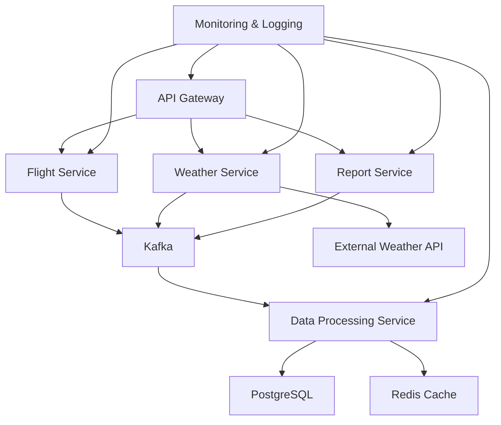

```markdown
# Aether System Architecture

## Table of Contents

1. [Introduction](#introduction)
2. [System Overview](#system-overview)
3. [Core Components](#core-components)
4. [Data Flow](#data-flow)
5. [Technology Stack](#technology-stack)
6. [Design Patterns and Principles](#design-patterns-and-principles)
7. [Scalability and Performance](#scalability-and-performance)
8. [Security](#security)
9. [Monitoring and Logging](#monitoring-and-logging)
10. [Disaster Recovery and High Availability](#disaster-recovery-and-high-availability)
11. [Future Considerations](#future-considerations)

## 1. Introduction

Aether is a high-performance, scalable Flight Weather Information System designed to process and analyze weather data for flight routes. This document provides a comprehensive overview of the system's architecture, detailing its components, interactions, and the rationale behind key design decisions.

## 2. System Overview

Aether is built on a microservices architecture, leveraging cloud-native technologies to ensure scalability, resilience, and maintainability. The system is designed to handle high volumes of flight and weather data, providing real-time weather information and reports for flight routes.

### High-Level Architecture Diagram



## 3. Core Components

### 3.1 API Gateway
- Serves as the entry point for all client requests
- Handles authentication, authorization, and rate limiting
- Routes requests to appropriate microservices

### 3.2 Flight Service
- Manages flight data and operations
- Processes incoming flight information
- Interacts with the database to store and retrieve flight data

### 3.3 Weather Service
- Retrieves weather data from external APIs
- Processes and stores weather information
- Provides weather data for specific airports and routes

### 3.4 Report Service
- Generates comprehensive flight weather reports
- Combines data from Flight and Weather services
- Produces on-demand and scheduled reports

### 3.5 Kafka Message Broker
- Enables asynchronous communication between services
- Ensures reliable message delivery and processing
- Supports event-driven architecture and data streaming

### 3.6 Data Processing Service
- Consumes messages from Kafka topics
- Performs data transformations and aggregations
- Updates the database and cache with processed data

### 3.7 PostgreSQL Database
- Primary data store for persistent data
- Stores flight information, weather data, and generated reports
- Utilizes TimescaleDB extension for efficient time-series data management

### 3.8 Redis Cache
- In-memory data structure store used for caching
- Improves performance by reducing database load
- Stores frequently accessed data and session information

## 4. Data Flow

1. Client requests are received by the API Gateway.
2. The API Gateway authenticates and routes the request to the appropriate service.
3. Services process the request, interacting with the database or external APIs as needed.
4. For data updates, services publish messages to Kafka topics.
5. The Data Processing Service consumes messages from Kafka, processes the data, and updates the database and cache.
6. Processed data is then available for retrieval through the API.

## 5. Technology Stack

- **Backend Framework**: NestJS (Node.js)
- **Programming Language**: TypeScript
- **Database**: PostgreSQL with TimescaleDB extension
- **Caching**: Redis
- **Message Broker**: Apache Kafka
- **API Documentation**: Swagger/OpenAPI
- **Containerization**: Docker
- **Container Orchestration**: Kubernetes
- **CI/CD**: GitHub Actions, ArgoCD
- **Monitoring**: Prometheus, Grafana
- **Logging**: ELK Stack (Elasticsearch, Logstash, Kibana)

## 6. Design Patterns and Principles

- **Microservices Architecture**: Enables independent scaling and deployment of services.
- **Event-Driven Architecture**: Utilizes Kafka for asynchronous communication and data processing.
- **CQRS (Command Query Responsibility Segregation)**: Separates read and write operations for improved performance and scalability.
- **Repository Pattern**: Abstracts data access logic in services.
- **Circuit Breaker Pattern**: Improves system resilience when interacting with external services.
- **Caching Strategy**: Implements multi-level caching (application-level and distributed) to optimize performance.

## 7. Scalability and Performance

- Horizontal scaling of stateless services through Kubernetes.
- Database read replicas for improved query performance.
- Caching layer to reduce database load and improve response times.
- Asynchronous processing of compute-intensive tasks using Kafka.
- Database partitioning and indexing strategies for efficient data retrieval.

## 8. Security

- JWT-based authentication for API access.
- Role-Based Access Control (RBAC) for fine-grained permissions.
- Data encryption at rest and in transit.
- Regular security audits and penetration testing.
- Rate limiting to prevent API abuse.
- Secure secrets management using Kubernetes Secrets and Vault.

## 9. Monitoring and Logging

- Centralized logging with ELK Stack for log aggregation and analysis.
- Prometheus for metrics collection and alerting.
- Grafana dashboards for visualizing system and business metrics.
- Distributed tracing with Jaeger for performance analysis.
- Automated alerting integrated with PagerDuty for incident management.

## 10. Disaster Recovery and High Availability

- Multi-region deployment for geographical redundancy.
- Regular automated backups of the database.
- Kafka multi-broker setup for message persistence and fault tolerance.
- Kubernetes-managed container orchestration for service resilience.
- Automated failover mechanisms for critical components.

## 11. Future Considerations

- Implementation of machine learning models for weather prediction.
- Integration with blockchain for immutable weather records.
- Expansion to include real-time flight tracking data.
- Development of a mobile application for on-the-go access to weather reports.
- Integration with additional weather data providers for increased accuracy and coverage.

This architecture is designed to provide a robust, scalable, and maintainable system for the Aether Flight Weather Information System. It leverages modern technologies and design patterns to ensure high performance, reliability, and security while allowing for future growth and enhancements.
```