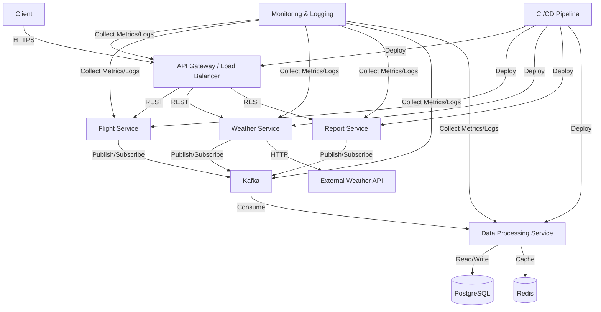

# Aether System Architecture Diagram

## High-Level Architecture



## Component Explanations and Justifications

### 1. Client
- **Description**: End-users or systems interacting with Aether.
- **Justification**: Provides a clear entry point for all external interactions.
- **Best Practice**: [Separation of Concerns](https://en.wikipedia.org/wiki/Separation_of_concerns)

### 2. API Gateway / Load Balancer
- **Technology**: [Nginx](https://www.nginx.com/) or [Kong](https://konghq.com/)
- **Description**: Manages incoming requests, handles authentication, and routes to appropriate services.
- **Justification**: Centralizes common functionalities and improves security.
- **Best Practice**: [API Gateway Pattern](https://microservices.io/patterns/apigateway.html)
- **Documentation**: [Nginx as API Gateway](https://www.nginx.com/blog/building-microservices-using-an-api-gateway/)

### 3. Flight Service
- **Technology**: [NestJS](https://nestjs.com/)
- **Description**: Manages flight-related operations and data.
- **Justification**: Modular service focused on a specific domain.
- **Best Practice**: [Microservices Architecture](https://martinfowler.com/articles/microservices.html)
- **Documentation**: [NestJS Documentation](https://docs.nestjs.com/)

### 4. Weather Service
- **Technology**: NestJS
- **Description**: Handles weather data retrieval and processing.
- **Justification**: Separates weather-specific logic for better maintainability.
- **Best Practice**: [Single Responsibility Principle](https://en.wikipedia.org/wiki/Single-responsibility_principle)

### 5. Report Service
- **Technology**: NestJS
- **Description**: Generates and manages flight weather reports.
- **Justification**: Isolates complex report generation logic.
- **Best Practice**: [Separation of Concerns](https://en.wikipedia.org/wiki/Separation_of_concerns)

### 6. Kafka
- **Technology**: [Apache Kafka](https://kafka.apache.org/)
- **Description**: Message broker for asynchronous communication between services.
- **Justification**: Enables event-driven architecture and decouples services.
- **Best Practice**: [Event-Driven Architecture](https://martinfowler.com/articles/201701-event-driven.html)
- **Documentation**: [Kafka Documentation](https://kafka.apache.org/documentation/)

### 7. Data Processing Service
- **Technology**: NestJS with [Kafka.js](https://kafka.js.org/)
- **Description**: Consumes and processes messages from Kafka.
- **Justification**: Centralizes data processing logic and updates data stores.
- **Best Practice**: [CQRS Pattern](https://martinfowler.com/bliki/CQRS.html)
- **Documentation**: [Kafka.js Documentation](https://kafka.js.org/docs/introduction)

### 8. PostgreSQL
- **Technology**: [PostgreSQL](https://www.postgresql.org/) with [TimescaleDB](https://www.timescale.com/)
- **Description**: Primary database for persistent storage of relational data.
- **Justification**: Robust, ACID-compliant database with time-series capabilities.
- **Best Practice**: [Use the right tool for the job](https://en.wikipedia.org/wiki/Use_the_right_tool_for_the_job)
- **Documentation**: [PostgreSQL Documentation](https://www.postgresql.org/docs/)

### 9. Redis
- **Technology**: [Redis](https://redis.io/)
- **Description**: In-memory data structure store used for caching.
- **Justification**: Improves performance by reducing database load.
- **Best Practice**: [Caching](https://aws.amazon.com/caching/)
- **Documentation**: [Redis Documentation](https://redis.io/documentation)

### 10. External Weather API
- **Description**: Third-party service providing weather data.
- **Justification**: Provides up-to-date weather information without maintaining own weather stations.
- **Best Practice**: [API Integration](https://swagger.io/resources/articles/best-practices-in-api-design/)

### 11. Monitoring & Logging
- **Technologies**: [Prometheus](https://prometheus.io/), [Grafana](https://grafana.com/), [ELK Stack](https://www.elastic.co/what-is/elk-stack)
- **Description**: Collects metrics and logs for system monitoring and troubleshooting.
- **Justification**: Ensures system health and aids in problem diagnosis.
- **Best Practice**: [Observability](https://docs.microsoft.com/en-us/azure/architecture/best-practices/monitoring)
- **Documentation**: [Prometheus Documentation](https://prometheus.io/docs/introduction/overview/)

### 12. CI/CD Pipeline
- **Technology**: [GitHub Actions](https://github.com/features/actions)
- **Description**: Automates building, testing, and deployment of services.
- **Justification**: Ensures consistent and reliable deployments.
- **Best Practice**: [Continuous Integration and Continuous Deployment](https://martinfowler.com/articles/continuousIntegration.html)
- **Documentation**: [GitHub Actions Documentation](https://docs.github.com/en/actions)

## Architectural Decisions and Patterns

1. **Microservices Architecture**: Allows for independent scaling and deployment of services.
   - [Microservices Guide](https://martinfowler.com/microservices/)

2. **Event-Driven Architecture**: Uses Kafka for asynchronous communication, improving system resilience and scalability.
   - [Event-Driven Architecture](https://aws.amazon.com/event-driven-architecture/)

3. **CQRS (Command Query Responsibility Segregation)**: Separates read and write operations for improved performance and scalability.
   - [CQRS Pattern](https://docs.microsoft.com/en-us/azure/architecture/patterns/cqrs)

4. **API Gateway Pattern**: Centralizes cross-cutting concerns like authentication and provides a single entry point for clients.
   - [API Gateway Pattern](https://microservices.io/patterns/apigateway.html)

5. **Database per Service**: Each service has its own database, ensuring loose coupling.
   - [Database per Service](https://microservices.io/patterns/data/database-per-service.html)

6. **Caching Strategy**: Implements Redis for caching to improve response times and reduce database load.
   - [Caching Best Practices](https://aws.amazon.com/caching/best-practices/)

7. **Containerization**: Uses Docker for consistent environments across development and production.
   - [Docker Documentation](https://docs.docker.com/)

8. **Container Orchestration**: Employs Kubernetes for managing containerized services.
   - [Kubernetes Documentation](https://kubernetes.io/docs/home/)

This architecture is designed to be scalable, resilient, and maintainable. It leverages modern cloud-native technologies and follows best practices in microservices and distributed systems design. The use of event-driven architecture with Kafka allows for loose coupling between services and enables real-time data processing. The combination of PostgreSQL and Redis provides a balance between data persistence and high-performance data access. Monitoring and logging ensure the system's health can be effectively tracked and issues can be quickly identified and resolved.
```